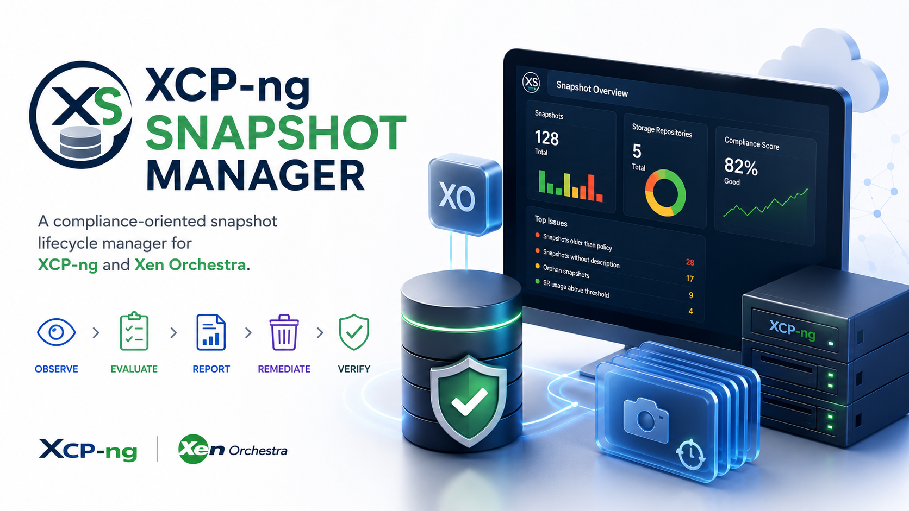

<p align="center">
  
</p>

<h1 align="center">XCP-ng Snapshot Manager</h1>

<p align="center">
The open-source compliance engine for XCP-ng snapshots.
</p>

<p align="center">


</p>

---

## Overview

**XCP-ng Snapshot Manager** is an open-source tool designed to audit, monitor and manage virtual machine snapshots across XCP-ng infrastructures.

Unlike generic administration tools, Snapshot Manager focuses exclusively on **Snapshots** and **Storage Repositories (SR)** to help administrators maintain healthy virtualization environments.

The project follows a simple execution workflow:

```text
Observe
   ↓
Evaluate
   ↓
Report
   ↓
Remediate
   ↓
Verify
```

---

## Current Status

Current release:

**v0.0.4**

Implemented:

* Provider abstraction
* Xen Orchestra REST connectivity
* Typed configuration
* Execution engine
* Modular architecture
* Check discovery engine
* Pool, host, VM, snapshot and Storage Repository inventory

---

## Roadmap

| Version | Status | Description              |
| ------- | ------ | ------------------------ |
| v0.0.1  | ✅      | Bootstrap                |
| v0.0.2  | ✅      | Configuration            |
| v0.0.3  | ✅      | Provider connection      |
| v0.0.4  | 🚧     | Infrastructure inventory |
| v0.0.5  | ⏳      | Compliance checks        |
| v0.0.6  | ⏳      | Reporting                |
| v0.0.7  | ⏳      | Remediation              |
| v1.0.0  | 🎯     | First stable release     |

---

## Planned Features

### Observe

* Inventory collection
* Snapshot discovery
* Storage Repository discovery
* Capacity collection

### Evaluate

* Snapshot age
* Snapshot count
* Missing descriptions
* Orphan snapshots
* Storage Repository usage

### Report

* Rich console output
* JSON export
* HTML reports

### Remediate

* Delete expired snapshots
* Blacklist support
* Dry-run mode
* Storage reclaim

### Verify

* Post-remediation validation
* Compliance confirmation

---

## Project Structure

```text
src/
├── checks/
├── clients/
├── config/
├── core/
├── providers/
├── reports/
└── snapshot_manager.py
```

---

## Requirements

* Python 3.12+
* Xen Orchestra 5.x
* XCP-ng
* REST API enabled

---

## Installation

```bash
git clone https://github.com/DenisFoulon/xcpng-snapshot-manager.git

cd xcpng-snapshot-manager

python3 -m venv .venv

source .venv/bin/activate

pip install -r requirements.txt
```

---

## Configuration

```yaml
provider:
  type: xo

xo:
  url: https://xoa.example.com/rest/v0
  username: admin@example.com
  password: your_password
  verify_ssl: false
```

---

## Run

```bash
python3 src/snapshot_manager.py
```

---

## Philosophy

This project intentionally remains focused on a single objective:

> **Manage snapshots safely and efficiently.**

It is **not** intended to become a full XCP-ng administration framework.

Keeping a limited scope helps maintain a clean architecture, predictable releases and long-term maintainability.

---

## License

MIT License.
