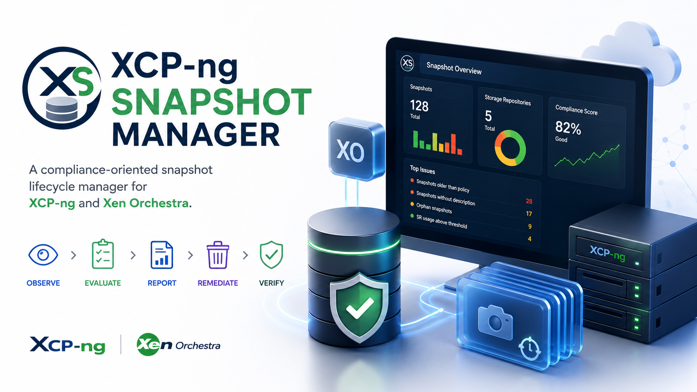

<p align="center">
  
</p>

<h1 align="center">XCP-ng Snapshot Manager</h1>

<p align="center">
  Keep your XCP-ng snapshots under control.
</p>

<p align="center">
  Audit, monitor and safely manage snapshot lifecycle across your XCP-ng infrastructure.
</p>

<p align="center">


</p>

---

## Why XCP-ng Snapshot Manager?

Snapshots are useful.

Until they are forgotten.

An old snapshot can remain on a Storage Repository for weeks or months, consuming valuable space and making the virtualization environment harder to manage.

In a production XCP-ng infrastructure, you may want to answer simple questions:

- Which VMs have too many snapshots?
- Which snapshots are getting old?
- Which Storage Repositories are running out of space?
- Are there orphaned snapshots?
- Which snapshots should be removed?
- Can remediation be automated without blindly deleting data?
- Are scheduled snapshots actually being created?

**XCP-ng Snapshot Manager** was built to answer these questions.

It provides a focused snapshot lifecycle and compliance engine for XCP-ng infrastructures managed through Xen Orchestra.

The goal is simple:

> **Know what is happening. Decide what should happen. Automate it safely.**

---

## What does it do?

The application follows a simple execution workflow:

```text
OBSERVE
   ↓
EVALUATE
   ↓
REPORT
   ↓
REMEDIATE
   ↓
VERIFY
```

### Observe

Collects infrastructure information from Xen Orchestra:

- Pools
- Hosts
- Virtual machines
- Snapshots
- Storage Repositories

### Evaluate

Checks your snapshot and Storage Repository policies:

- Snapshot age
- Snapshot count
- Missing descriptions
- Orphan snapshots
- Storage Repository usage

### Report

Provides useful information for administrators:

- Console output
- JSON data
- HTML reports

### Remediate

When explicitly enabled, the application can:

- Delete expired snapshots
- Respect configured policies
- Support blacklist/exclusion rules
- Run in dry-run mode
- Perform Storage Repository maintenance

### Verify

After remediation, the system can validate the resulting state instead of simply assuming that an operation succeeded.

---

## Typical use case

Imagine a VM with the following snapshots:

```text
VM: production-db01

Snapshot                     Age
────────────────────────────────────
pre-upgrade                  2 days
before-maintenance           9 days
migration-test              47 days
old-test                   126 days
```

Your policy might say:

```text
Warning  → 7 days
Critical → 30 days
```

The manager can identify the snapshots that require attention and report them.

If remediation is enabled, it can then remove snapshots according to the configured policy.

No blind `xe snapshot-uninstall` loop.

No database.

No web application.

No daemon.

Just a focused tool that can be executed when you need it.

---

# Quick Start

The goal is to get your **first audit running in a few minutes**.

## 1. Clone the project

```bash
git clone https://github.com/DenisFoulon/xcpng-snapshot-manager.git
cd xcpng-snapshot-manager
```

## 2. Create a Python environment

```bash
python3 -m venv .venv
source .venv/bin/activate
pip install -r requirements.txt
```

## 3. Create your configuration

```bash
cp config/config.example.yaml config/config.yaml
```

Edit the Xen Orchestra connection:

```yaml
provider:
  type: xo

xo:
  url: https://xoa.example.com/rest/v0
  username: admin@example.com
  password: your_password
  verify_ssl: false
```

Your local `config/config.yaml` is ignored by Git, so credentials are not committed to the repository.

## 4. Run your first audit

```bash
PYTHONPATH=src python3 src/snapshot_manager.py
```

That's it.

You now have a snapshot compliance scan of your XCP-ng infrastructure.

---

# Run it automatically

XCP-ng Snapshot Manager is intentionally designed as a **one-shot command**.

That makes it easy to integrate with cron or a systemd timer.

For example, a daily cron job:

```cron
0 2 * * * cd /opt/xcpng-snapshot-manager && /opt/xcpng-snapshot-manager/.venv/bin/python src/snapshot_manager.py >> /var/log/xcpng-snapshot-manager.log 2>&1
```

This gives you a lightweight daily snapshot compliance process without deploying another permanent service.

---

# Snapshot policies

Snapshot policies are configurable.

For example:

```yaml
compliance:
  snapshot_age:
    warning_days: 7
    critical_days: 30

  snapshot_count:
    warning_count: 3
    critical_count: 5
```

This allows administrators to define what "healthy" means for their environment rather than relying on hard-coded values.

---

# Template safety

Virtual machine templates are excluded from snapshot management by default.

```yaml
snapshot_management:
  include_templates: false
```

This is intentional.

Templates can contain snapshots that are part of an operational workflow and should not automatically be treated like ordinary VM snapshots.

If your environment requires template snapshots to be managed, this behaviour can be explicitly enabled:

```yaml
snapshot_management:
  include_templates: true
```

---

# Safe remediation

Remediation is deliberately designed to be conservative.

The recommended workflow is:

```text
AUDIT
  ↓
INSPECT
  ↓
DRY-RUN
  ↓
EXECUTE
  ↓
VERIFY
```

The manager should first tell you what it sees before being allowed to modify the infrastructure.

This makes it suitable for environments where snapshot deletion must be predictable and controlled.

---

# Storage Repository monitoring

Snapshots ultimately consume Storage Repository capacity.

The manager therefore also monitors Storage Repository usage and can perform optional SR maintenance.

SR maintenance is **disabled by default**.

```yaml
maintenance:
  vacuum:
    enabled: false
    mode: audit
    interval_hours: 24
    min_interval_hours: 20
    blacklist_sr_uuids: []
    state_file: state/sr_maintenance.json
    task_timeout_minutes: 30
```

All Storage Repositories are discovered automatically.

You only need to list exceptional SRs in `blacklist_sr_uuids`.

The maintenance mechanism also includes:

- Automatic SR discovery
- Blacklisting
- Cooldown protection
- Task polling
- Timeout handling
- Before/after free-space reporting
- Persistent state

---

# Scheduled VM snapshots

The project also supports simple file-based scheduled VM snapshots.

A request can be represented by a text file:

```text
2026-08-05 14:40
vm1
vm2
vm*
```

The scheduled snapshot worker can then be launched by cron:

```bash
PYTHONPATH=src python3 src/snapshot_manager.py --run-scheduled-snapshots
```

Only `.txt` request files are processed.

After a complete success, the request is archived as:

```text
.done.txt
```

If one or more snapshots fail, the request is renamed:

```text
.failed.txt
```

The result of every VM is appended to the request file.

Failed requests are **not automatically retried**.

Configuration:

```yaml
snapshot_scheduling:
  enabled: false
  mode: audit
  input_directory: config/snapshot_requests
  archive_directory: config/snapshot_archives
  timezone: Europe/Paris
  max_snapshot_lateness_minutes: 60
  snapshot_name_prefix: scheduled
  task_timeout_minutes: 30
```

---

# Configuration

The complete configuration is provided in:

```text
config/config.example.yaml
```

The configuration is deliberately file-based and easy to version or manage through standard configuration-management tools.

Typical deployment:

```text
/opt/xcpng-snapshot-manager/
├── config/
│   ├── config.yaml
│   └── snapshot_requests/
├── src/
├── reports/
└── .venv/
```

---

# Reports

The manager is designed to provide both human-readable and machine-readable results.

This makes it suitable for:

- Manual administration
- Cron jobs
- Automation
- Monitoring integration
- Compliance reporting
- Operational reviews

---

# Requirements

- Python 3.12+
- Xen Orchestra 5.x
- XCP-ng
- Xen Orchestra REST API enabled

The application communicates with XCP-ng through Xen Orchestra rather than directly connecting to individual hosts.

---

# Architecture

The project uses a modular architecture designed to keep infrastructure access, compliance logic and reporting separated.

```text
                    ┌─────────────────────┐
                    │   Xen Orchestra     │
                    │      REST API       │
                    └──────────┬──────────┘
                               │
                               ▼
                    ┌─────────────────────┐
                    │      Provider       │
                    │     XOProvider      │
                    └──────────┬──────────┘
                               │
                               ▼
                    ┌─────────────────────┐
                    │     Inventory       │
                    │ Pool / Host / VM /  │
                    │ Snapshot / SR       │
                    └──────────┬──────────┘
                               │
                               ▼
                    ┌─────────────────────┐
                    │   Compliance Engine │
                    └──────────┬──────────┘
                               │
                 ┌─────────────┼─────────────┐
                 ▼             ▼             ▼
             Reporting     Remediation   Maintenance
```

Project structure:

```text
src/
├── checks/
├── clients/
├── config/
├── core/
├── providers/
├── reports/
└── snapshot_manager.py
```

---

# Release history

The project has evolved incrementally, with each release adding one layer of functionality.

| Version | Status | Description |
|---|---|---|
| v0.0.1 | ✅ | Bootstrap |
| v0.0.2 | ✅ | Configuration |
| v0.0.3 | ✅ | Provider connection |
| v0.0.4 | ✅ | Infrastructure inventory |
| v0.0.5 | ✅ | Compliance checks |
| v0.0.6 | ✅ | Reporting |
| v0.0.7 | ✅ | Remediation |
| v0.0.8 | ✅ | Advanced SR vacuum |
| v0.0.9 | ✅ | Scheduled VM snapshots |
| **v1.0.0** | **✅** | **First stable release** |

---

# Current status

**v1.0.0 — Stable**

The first stable release provides:

- Xen Orchestra REST connectivity
- Provider abstraction
- Typed configuration
- Modular execution engine
- Infrastructure inventory
- Snapshot compliance checks
- Storage Repository monitoring
- Console, JSON and HTML reporting
- Safe remediation modes
- Template-aware snapshot management
- Storage Repository maintenance
- Scheduled VM snapshots
- Cron-friendly one-shot execution

The project is intentionally focused.

---

# Philosophy

XCP-ng Snapshot Manager is **not** intended to become a complete XCP-ng administration platform.

It focuses on one specific operational problem:

> **Manage snapshots safely and efficiently.**

Keeping the scope limited helps maintain:

- A clean architecture
- Predictable behaviour
- Easy deployment
- Simple configuration
- Maintainable code
- Small operational footprint

If you already operate XCP-ng and Xen Orchestra, the tool should be easy to understand, easy to test and easy to remove if it doesn't fit your environment.

---

# Contributing

Contributions, ideas, bug reports and improvements are welcome.

If you operate XCP-ng in production and encounter a real-world snapshot management problem, feel free to open an issue and describe the use case.

---

# License

MIT License.